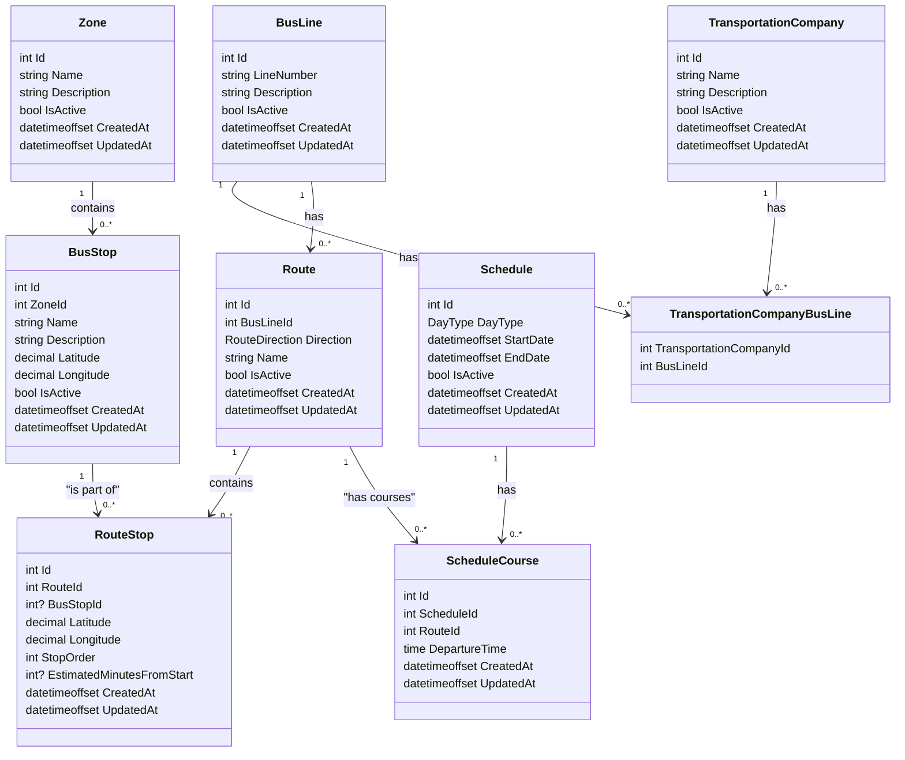

# ShumenTraffic - Database Schema

## Overview

This document describes the database schema for the ShumenTraffic application. The schema is designed to support:
- Multiple transportation companies
- Bus lines with different routes and directions
- Bus stops organized in zones
- Schedules with courses (trips/departures) that can use different routes
- Route variations (weekdays, Saturdays, Sundays) via day type in Schedule
- Route swapping: different courses in the same schedule can use different routes

## Class Diagram



## Enum Descriptions

### DayType
- Weekday = 0
- Saturday = 1
- Sunday = 2

### RouteDirection
- One = 1
- Two = 2

## Entity Descriptions

### TransportationCompany
Represents a transportation company operating bus lines.

| Column | Type | Constraints | Description |
|--------|------|-------------|-------------|
| Id | int | PK, Auto | Primary key |
| Name | string(255) | NOT NULL, UNIQUE | Company name |
| Description | string(1000) | | Company description |
| IsActive | bool | NOT NULL, Default=true | Active status |
| CreatedAt | datetimeoffset | NOT NULL | Creation timestamp |
| UpdatedAt | datetimeoffset | NOT NULL | Last update timestamp |

### BusLine
Represents a bus line that can be operated by one or more transportation companies.

| Column | Type | Constraints | Description |
|--------|------|-------------|-------------|
| Id | int | PK, Auto | Primary key |
| LineNumber | string(50) | NOT NULL | Line number (e.g., "1", "2A") |
| Description | string(1000) | | Line description |
| IsActive | bool | NOT NULL, Default=true | Active status |
| CreatedAt | datetimeoffset | NOT NULL | Creation timestamp |
| UpdatedAt | datetimeoffset | NOT NULL | Last update timestamp |

### Route
Represents a specific route for a bus line with direction.

| Column | Type | Constraints | Description |
|--------|------|-------------|-------------|
| Id | int | PK, Auto | Primary key |
| BusLineId | int | FK, NOT NULL | Reference to bus line |
| Direction | int | NOT NULL | Direction (1 or 2) |
| Name | string(255) | | Route name |
| IsActive | bool | NOT NULL, Default=true | Active status |
| CreatedAt | datetimeoffset | NOT NULL | Creation timestamp |
| UpdatedAt | datetimeoffset | NOT NULL | Last update timestamp |

### BusStop
Represents a physical bus stop location.

| Column | Type | Constraints | Description |
|--------|------|-------------|-------------|
| Id | int | PK, Auto | Primary key |
| ZoneId | int | FK, NOT NULL | Reference to zone |
| Name | string(255) | NOT NULL, UNIQUE | Stop name |
| Description | string(1000) | | Stop description |
| Latitude | decimal(10,8) | NOT NULL | GPS latitude |
| Longitude | decimal(11,8) | NOT NULL | GPS longitude |
| IsActive | bool | NOT NULL, Default=true | Active status |
| CreatedAt | datetimeoffset | NOT NULL | Creation timestamp |
| UpdatedAt | datetimeoffset | NOT NULL | Last update timestamp |

### RouteStop
Represents a point on a specific route. Can be either an actual bus stop (where passengers board/alight) or a waypoint that defines the route path between stops.

| Column | Type | Constraints | Description |
|--------|------|-------------|-------------|
| Id | int | PK, Auto | Primary key |
| RouteId | int | FK, NOT NULL | Reference to route |
| BusStopId | int | FK, NULLABLE | Reference to bus stop (NULL = waypoint only) |
| Latitude | decimal(10,8) | NOT NULL | GPS latitude coordinate |
| Longitude | decimal(11,8) | NOT NULL | GPS longitude coordinate |
| StopOrder | int | NOT NULL | Order of point in route (1-based) |
| EstimatedMinutesFromStart | int | NULLABLE | Minutes from route start (only for actual stops, NULL for waypoints) |
| CreatedAt | datetimeoffset | NOT NULL | Creation timestamp |
| UpdatedAt | datetimeoffset | NOT NULL | Last update timestamp |

**Notes:**
- When `BusStopId IS NOT NULL`: This is an actual bus stop with passenger boarding/alighting
- When `BusStopId IS NULL`: This is a waypoint that defines the route path between stops
- `StopOrder` maintains sequence of all points (stops + waypoints) in order
- `EstimatedMinutesFromStart` is only populated for actual bus stops, used for schedule calculations
- Coordinates are used to draw the route polyline on the map and calculate live bus positions

### Zone
Represents a geographical zone/neighborhood.

| Column | Type | Constraints | Description |
|--------|------|-------------|-------------|
| Id | int | PK, Auto | Primary key |
| Name | string(255) | NOT NULL, UNIQUE | Zone name |
| Description | string(1000) | | Zone description |
| IsActive | bool | NOT NULL, Default=true | Active status |
| CreatedAt | datetimeoffset | NOT NULL | Creation timestamp |
| UpdatedAt | datetimeoffset | NOT NULL | Last update timestamp |

### Schedule
Represents a schedule for a specific date range and day type. Contains multiple courses (trips/departures), each specifying which route it uses.

| Column | Type | Constraints | Description |
|--------|------|-------------|-------------|
| Id | int | PK, Auto | Primary key |
| DayType | int | NOT NULL | Weekday, Saturday or Sunday |
| StartDate | datetimeoffset | NOT NULL | Schedule start date |
| EndDate | datetimeoffset | | Schedule end date (null = ongoing) |
| IsActive | bool | NOT NULL, Default=true | Active status |
| CreatedAt | datetimeoffset | NOT NULL | Creation timestamp |
| UpdatedAt | datetimeoffset | NOT NULL | Last update timestamp |

**Notes:**
- Schedule does not directly reference a route; instead, each course in the schedule specifies which route it uses
- This allows different courses in the same schedule to use different routes (route swapping)

### ScheduleCourse
Represents a course (trip/departure) for a schedule on a specific route.

| Column | Type | Constraints | Description |
|--------|------|-------------|-------------|
| Id | int | PK, Auto | Primary key |
| ScheduleId | int | FK, NOT NULL | Reference to schedule |
| RouteId | int | FK, NOT NULL | Reference to route |
| DepartureTime | time | NOT NULL | Departure time from route start |
| CreatedAt | datetimeoffset | NOT NULL | Creation timestamp |
| UpdatedAt | datetimeoffset | NOT NULL | Last update timestamp |

**Notes:**
- `DepartureTime` is the departure time from the start of the route
- Actual departure times at each stop are calculated by adding `EstimatedMinutesFromStart` from `RouteStop`
- Supports route swapping: different courses in the same schedule can use different routes

### TransportationCompanyBusLine
Junction table for the many-to-many relationship between TransportationCompany and BusLine.

| Column | Type | Constraints | Description |
|--------|------|-------------|-------------|
| TransportationCompanyId | int | PK, FK, NOT NULL | Reference to transportation company |
| BusLineId | int | PK, FK, NOT NULL | Reference to bus line |

## Key Relationships

1. **TransportationCompany ↔ BusLine** (M:N)
   - One company can operate multiple bus lines
   - One bus line can be operated by multiple companies
   - Linked through TransportationCompanyBusLine junction table

2. **BusLine → Route** (1:N)
   - One bus line has multiple routes (different directions)

3. **Route → RouteStop** (1:N)
   - One route contains multiple stops (actual bus stops and waypoints)

4. **BusStop → RouteStop** (1:N)
   - One bus stop can be part of multiple routes

5. **Zone → BusStop** (1:N)
   - One zone contains multiple bus stops

6. **Route → ScheduleCourse** (1:N)
   - One route can be used by multiple courses (trips/departures)

7. **Schedule → ScheduleCourse** (1:N)
   - One schedule has multiple courses (trips/departures)
   - Each course specifies which route it uses, enabling route swapping within a schedule

## Live Bus Position System

The system supports two modes for determining bus location:

### Mode 1: Calculated Position (Current)
- Server calculates bus position based on schedule data
- Uses `RouteStop` waypoints and `EstimatedMinutesFromStart` values
- Client receives progress percentage between two stops
- Client interpolates exact position along the polyline using all waypoints
- Works immediately without real GPS data

### Mode 2: Real GPS Position (Future)
- Server receives actual GPS coordinates from buses
- Server returns exact latitude/longitude
- Client displays position directly
- More accurate once real tracking data is available

### API Response Format
The server endpoint `GET /api/routes/{routeId}/buses/{busId}/current-position` returns:

**Real GPS Mode:**
```json
{
  "busId": 5,
  "routeId": 1,
  "positionType": "real",
  "latitude": 43.2805,
  "longitude": 26.4970,
  "timestamp": "2025-10-30T10:07:32Z",
  "accuracy": 5.2
}
```

**Calculated Mode:**
```json
{
  "busId": 5,
  "routeId": 1,
  "positionType": "calculated",
  "progressPercentage": 0.52,
  "currentStopOrder": 1,
  "nextStopOrder": 2,
  "currentStopId": 1,
  "nextStopId": 2,
  "timestamp": "2025-10-30T10:07:32Z"
}
```

### Client-Side Logic
- If `positionType === "real"`: Display pin at provided coordinates
- If `positionType === "calculated"`: Interpolate position along polyline using progress percentage and waypoints

## Indexes

Recommended indexes for performance:

```sql
-- Search and filtering
CREATE INDEX IX_TransportationCompanyBusLine_TransportationCompanyId ON TransportationCompanyBusLine(TransportationCompanyId);
CREATE INDEX IX_TransportationCompanyBusLine_BusLineId ON TransportationCompanyBusLine(BusLineId);
CREATE INDEX IX_Route_BusLineId ON Route(BusLineId);
CREATE INDEX IX_BusStop_ZoneId ON BusStop(ZoneId);
CREATE INDEX IX_RouteStop_RouteId ON RouteStop(RouteId);
CREATE INDEX IX_RouteStop_BusStopId ON RouteStop(BusStopId);
CREATE INDEX IX_RouteStop_StopOrder ON RouteStop(RouteId, StopOrder);
CREATE INDEX IX_ScheduleCourse_ScheduleId ON ScheduleCourse(ScheduleId);
CREATE INDEX IX_ScheduleCourse_RouteId ON ScheduleCourse(RouteId);

-- Active records
CREATE INDEX IX_BusLine_IsActive ON BusLine(IsActive);
CREATE INDEX IX_Route_IsActive ON Route(IsActive);
CREATE INDEX IX_BusStop_IsActive ON BusStop(IsActive);
CREATE INDEX IX_Schedule_IsActive ON Schedule(IsActive);

-- Unique constraints
CREATE UNIQUE INDEX IX_BusStop_Name ON BusStop(Name);
CREATE UNIQUE INDEX IX_Zone_Name ON Zone(Name);
```

## Authentication & Authorization

User authentication and authorization are handled by **ASP.NET Core Identity**. The `ShumenTrafficDbContext` derives from `IdentityDbContext<TUser, TRole, TKey>` to integrate Identity tables and functionality. This provides:

- User account management (registration, login, password reset)
- Role-based access control (RBAC)
- Claims-based authorization
- Built-in security features (password hashing, lockout policies, etc.)

Identity tables are automatically managed by the framework and are separate from the domain entities listed above.

## Notes

- All timestamps use UTC
- Soft deletes are not used; instead, `IsActive` flag is used
- DayType values: "Weekday", "Saturday", "Sunday"
- Direction values: 1 or 2
- Coordinates use WGS84 (EPSG:4326) for Leaflet.js compatibility
- `RouteStop.BusStopId` is nullable to support waypoints (intermediate route points)
- `RouteStop.EstimatedMinutesFromStart` is only populated for actual bus stops (when `BusStopId IS NOT NULL`)
- Live bus position calculation happens server-side; client receives either real GPS coords or calculated progress percentage
