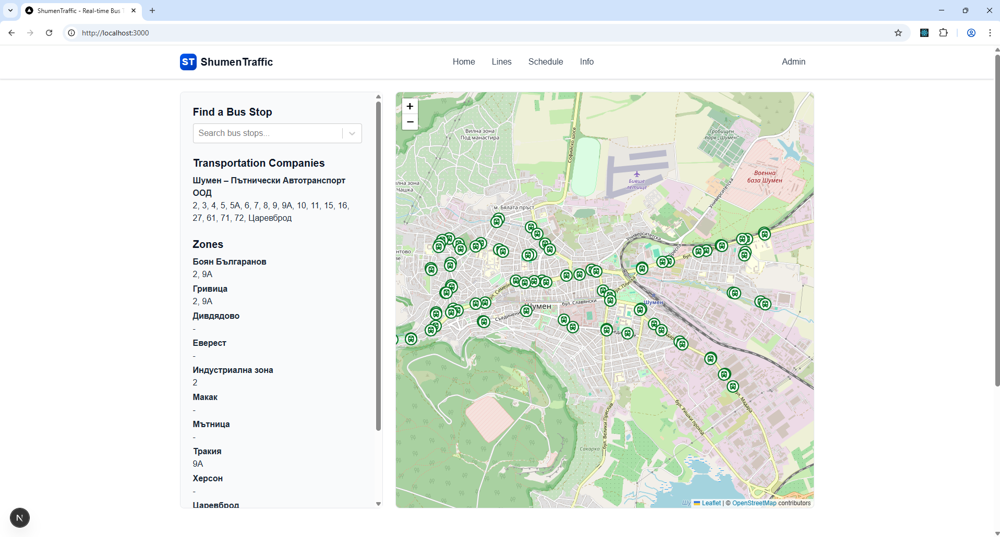
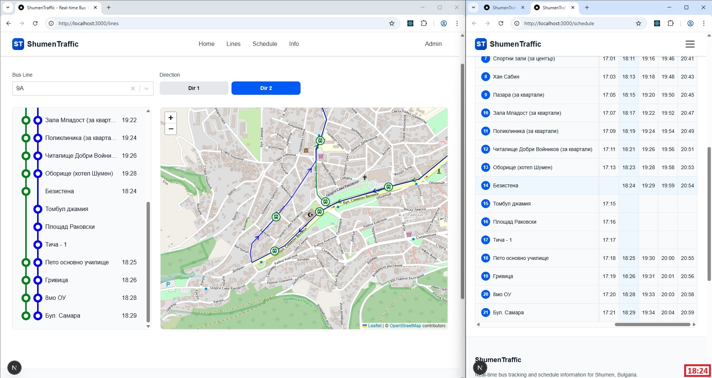

# ShumenTraffic

A website for tracking live buses in Shumen, Bulgaria with real-time bus stop information, schedules, and route management.

## 🟥 **Warning**
**Status: Under development!**

## Screenshots



## Project Overview

ShumenTraffic provides users with:
- Real-time bus stop information
- Bus schedules with approximate times for intermediate stops
- Interactive maps showing bus routes and stops
- Support for different routes on weekdays and weekends
- Admin interface for managing bus lines, stops, routes, and schedules

## Technology Stack

### Frontend
- **Framework**: Next.js
- **Maps**: Leaflet.js
- **Styling**: TailwindCSS

### Backend
- **Framework**: ASP.NET Core Web API
- **Database**: MSSQL

### Version Control
- **Git/GitHub**

## Project Structure

```
ShumenTraffic/
├── Client/              # Next.js frontend application
├── Server/              # ASP.NET Core backend API
├── Docs/                # Documentation
└── LICENSE.md           # License file
```

## Features

### Public Features
1. **Stops Page (Home)**
   - Search for bus stops with autocomplete
   - View transportation companies and their lines
   - Browse zones and their stops
   - Interactive map showing all bus stops

2. **Lines Page**
   - Select a bus line and direction
   - View all stops for the selected line
   - See expected times for each stop
   - Interactive map showing the route and current bus positions

3. **Schedule Page**
   - View complete schedule for a bus line
   - Select date and direction
   - Table view with stops (rows) and times (columns)
   - Row/column highlighting on cell click

4. **Info Page**
   - General information about the service
   - News and updates

### Admin Features
- Admin login (username/password)
- CRUD operations for:
  - Transportation Companies
  - Zones
  - Bus Stops
  - Bus Lines
  - Routes
  - Schedules

## Getting Started

### Prerequisites
- .NET 10.0 or higher
- Node.js 16.0 or higher
- MSSQL Server (local instance)
- Git

### Installation

1. Clone the repository
```bash
git clone https://github.com/lneshev/ShumenTraffic.git
cd ShumenTraffic
```

2. Setup Backend
```bash
cd Server
dotnet restore
dotnet build
```

3. Setup Frontend
```bash
cd ../Client
npm install
```

### Configuration

1. Configure MSSQL connection string in `Server/appsettings.json`
2. Configure API endpoint in `Client/.env.local`

### Running the Application

**Backend:**
```bash
cd Server
dotnet run
```

**Frontend:**
```bash
cd Client
npm run dev
```

The application will be available at `http://localhost:3000`

## Development

### Implementation Approach
- Done with a help from AI and manual edits
- Task-by-task implementation with testing at each step
- Consistent BE/FE contracts throughout development
- Mobile-friendly responsive design
- Support for 1000+ concurrent users

### Data Source
- Initial data from https://shumenpat.com/razpisanie.htm
- Web scraping and parsing into database entities
- Admin modifications via CRUD pages

## Documentation

- [Project Plan](PROJECT_PLAN.md) - Detailed task list and phases
- [Clarifications](CLARIFICATIONS.md) - Project decisions and guidelines

## License

This project is licensed with **All Rights Reserved - Proprietary License**. See the [LICENSE](https://github.com/lneshev/ShumenTraffic/blob/main/LICENSE.md) file for details.